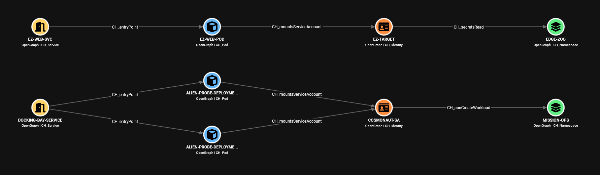

<p align="center">
  
</p>

<p align="center">
  
  
  
</p>

---

ClusterHound brings Kubernetes into [BloodHound CE](https://github.com/SpecterOps/BloodHound). It collects a cluster's topology and RBAC configuration with `kubectl` and outputs an [OpenGraph](https://bloodhound.specterops.io/opengraph/overview) JSON file for ingestion, turning multi-hop Kubernetes attack paths - service-account assumption, privilege escalation, host escape, secret access - into traversable edges you can pathfind across.

<p align="center">
  
</p>

## How it works

1. **Collect** - reads pods, services, secrets, RBAC, workloads, nodes and more from your current context.
2. **Resolve** - flattens Roles, ClusterRoles and their bindings into a direct map of *identity → capability*.
3. **Map** - emits nodes and attack-path edges (privilege escalation, service-account assumption, host escape, secret access, unauthenticated exposure) as OpenGraph JSON.
4. **Analyse** - ingest into BloodHound CE and query, pathfind, and visualise.

## Requirements

- Python 3.8+
- `kubectl` installed and on your `PATH`
- A kubeconfig pointing at the target cluster (defaults to `~/.kube/config` or `$KUBECONFIG`; override with `--kubeconfig` / `--context`)
- Read access to the resources you want mapped. ClusterHound only reads (`get`/`list`) and maps whatever the credentials can see - that can be cluster-wide or scoped to one or more namespaces. With namespace-scoped access, cluster-wide resources (nodes, ClusterRoles, etc.) are simply skipped and the rest is mapped from what is visible.
- BloodHound CE v9.0+ (the version that added [structured graph](https://bloodhound.specterops.io/opengraph/overview#structured-graphs) support, which ClusterHound's edges rely on)
- For the query importer only: `pip install -r requirements.txt` (just `requests`)

## Quick start

### 1. First time BloodHound CE setup

1. In BloodHound CE, go to Administration → Early Access Features and enable OpenGraph Extension Management.
2. Go to Administration → OpenGraph Management and upload [`schema.json`](schema.json) (registers ClusterHound's node icons, edge labels, and traversability).
3. Import the saved queries:
   ```bash
   pip install -r requirements.txt
   python import_queries.py -u <bloodhound-url> -U <username> -P <password>
   ```
   `<bloodhound-url>` is the base URL of your BloodHound CE instance, e.g. `http://localhost:8080`.

### 2. Collect

```bash
python clusterhound.py
```

This writes `clusterhound.json` from your current kubeconfig context.

### 3. Ingest

Upload `clusterhound.json` via the BloodHound CE file ingest UI, then use pathfinding to map routes between nodes, explore the ClusterHound saved queries, or run your own Cypher.

## Usage

```
python clusterhound.py [-o OUTPUT] [-n NAMESPACE] [--kubeconfig PATH] [--context NAME] [-v]
```

| Flag | Description |
|------|-------------|
| `-o`, `--output` | Output file path (default: `clusterhound.json`) |
| `-n`, `--namespace` | Restrict collection to specific namespace(s), comma-separated: `-n default,kube-system` (default: cluster-wide) |
| `--kubeconfig` | Path to the kubeconfig file to use (default: `$KUBECONFIG` or `~/.kube/config`) |
| `--context` | Kubeconfig context to collect from (default: current-context) |
| `-v`, `--verbose` | Verbose/debug logging |

```bash
# Collect from a specific context, scoped to two namespaces
python clusterhound.py --context prod-eks -n namespace1,namespace2 -o prod.json
```

## What it maps

ClusterHound models the cluster as 15 node kinds (Cluster, Namespace, Node, Pod, Workload, Service, Secret, Identity, Volume, Role/ClusterRole, RoleBinding/ClusterRoleBinding, IMDS, External Actor) connected by 27 edge kinds covering:

- **Privilege escalation** - `canBind`, `canEscalate`, `canImpersonate`, `canCreateToken`, `fullAccess`
- **Service-account assumption** - `canAssumeServiceAccount` (a derived edge that collapses workload creation, token minting, impersonation and token-secret planting into one traversable hop), `mountsServiceAccount`
- **Workload control** - `canExec`, `canAttach`, `canPortForward`, `canCreateWorkload`, `canPatch`, `canCreateEphemeral`
- **Secret access** - `secretsRead`, `secretsCreate`
- **Host & node escape** - `podPrivileged`, `podHostPID`, `podHostNetwork`, `podHostIPC`, `nodesProxyRCE`
- **Exposure** - `entryPoint`, `unauthAPIAccess`, `unauthKubeletAccess`, `accessIMDS`

Each node and edge kind has a reference page under [`NodeDescriptions/`](NodeDescriptions) and [`EdgeDescriptions/`](EdgeDescriptions) documenting its meaning and abuse.

## Analysis

ClusterHound's traversable edges are emitted as a [structured graph](https://bloodhound.specterops.io/opengraph/overview#structured-graphs), which BloodHound CE's pathfinding understands natively. Set a start and end node in the UI and BloodHound returns the shortest route between them across ClusterHound's edges.

31 pre-built Cypher queries also ship in [`customqueries.json`](customqueries.json) (catalogued in [`QUERIES.md`](QUERIES.md)), covering areas such as entry-point exposure, identities with dangerous permissions, namespace-segmentation violations, and shortest-path routes to full cluster compromise. These are a starting point - you can write your own Cypher against ClusterHound's nodes and edges for anything they don't cover.

## Documentation

- [`QUERIES.md`](QUERIES.md) - the saved-query catalogue
- [`NodeDescriptions/`](NodeDescriptions) - every node kind, its scope and properties
- [`EdgeDescriptions/`](EdgeDescriptions) - every edge kind, with abuse guidance

## Status

ClusterHound is under active development. A small number of edges (`unauthAPIAccess`, `unauthKubeletAccess`, `accessIMDS`) are flagged for manual verification and are mostly superficial - they mark a *potential* path that live network/anonymous-auth checks do not yet confirm. This functionality will be expanded in due course.

## Authors

Built and maintained by [dovesec](https://github.com/dovesec) and [Th3MuffinM4n](https://github.com/Th3MuffinM4n). Bug reports, feature requests, and new edge ideas are welcome - please [open an issue](https://github.com/dovesec/ClusterHound/issues).

## Disclaimer

ClusterHound is intended for authorised security assessment, research, and defensive use only. Run it only against clusters you own or have explicit permission to test. You are responsible for how you use it, and the authors accept no liability for any misuse or damage. Provided as-is, without warranty of any kind.
